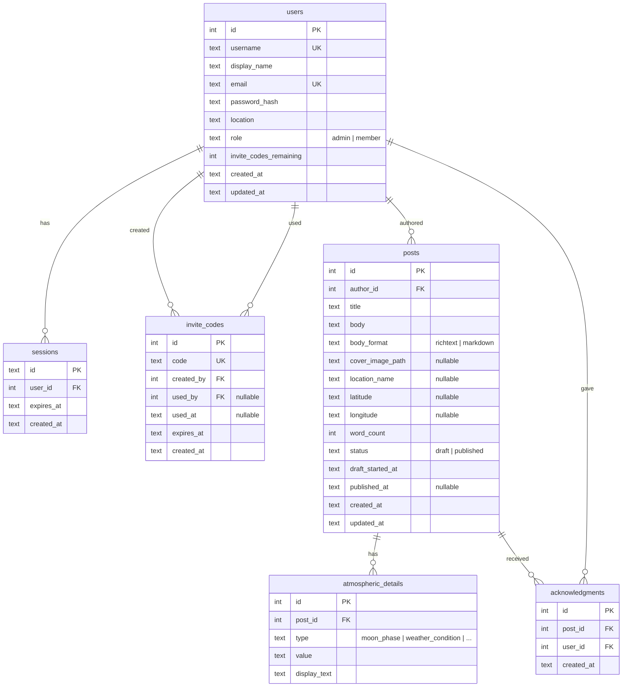

# Today, Today and Today

A daily writing platform for capturing moments, one day at a time. An invite-only community where writers share poetry, reflections, and daily musings in a beautiful, distraction-free environment.

Each post captures the atmosphere of the moment it was written — the weather, the moon phase, the quality of light — details that anchor a memory in time and place.

## Features

- **Daily writing** — up to 5 entries per day, with rich text editing (bold, italic, links, blockquotes)
- **Atmospheric context** — each post captures poetic details like weather conditions, moon phase, golden hour, and poetic season
- **Cover images** — upload a photo for each post, displayed with title overlay
- **Invite-only** — users join with single-use invite codes (3 per user, 30-day expiry)
- **"I see you" acknowledgments** — a quiet way to recognize someone's writing (no comments, no metrics)
- **Author profiles** — browse any writer's archive
- **Admin dashboard** — user management, post moderation, invite code oversight
- **Beautiful typography** — Cormorant Garamond for headings, Lora for body text, Inter for UI

## Tech Stack

- **Next.js 16** (App Router, Server Components, Server Actions)
- **TypeScript**
- **SQLite** via **Drizzle ORM**
- **Tailwind CSS v4**
- **Tiptap** (rich text editor)
- **Sharp** (image processing)
- **OpenWeatherMap API** (atmospheric data)

## Database Relationships



All foreign keys cascade on deletion — deleting a user removes their sessions, posts, acknowledgments, and invite codes.

## Setup

### Prerequisites

- Node.js 18+
- pnpm

### Install and run

```bash
# Install dependencies
pnpm install

# Seed the database (creates SQLite DB, runs migrations, inserts sample data)
pnpm db:seed

# Start the dev server
pnpm dev
```

The app runs at `http://localhost:3000`.

### Seed accounts

| Email | Role | Password |
|---|---|---|
| magalhini@gmail.com | admin | password123 |
| lena@example.com | member | password123 |
| kai@example.com | member | password123 |

### Environment variables

Create `.env.local` in the project root:

```
DATABASE_URL=./data/today.db
SESSION_SECRET=dev-secret-change-in-production-please
OPENWEATHERMAP_API_KEY=your_key_here
```

The weather API key is optional. Without it, atmospheric details will only include moon phase and poetic season (no weather, temperature, or sun-based details). Get a free key at [openweathermap.org](https://openweathermap.org/api).

### Database commands

```bash
pnpm db:generate   # Generate a new migration from schema changes
pnpm db:migrate    # Run pending migrations
pnpm db:seed       # Reset and seed the database (destructive)
pnpm db:studio     # Open Drizzle Studio (database GUI)
```

### Image uploads

Uploaded images are stored in `./uploads/` locally. The database stores only the relative path. In production, configure `UPLOAD_DIR` to point to a persistent directory (e.g., `/var/data/uploads`).

## Project Structure

```
src/
  app/
    (authenticated)/      # Routes behind auth (dashboard, write, post, profile, settings, admin)
    about/                # Public about page
    api/                  # API routes (upload, uploads, weather, atmospheric)
    login/                # Login page
    register/             # Registration page
    globals.css           # Design tokens, typography, editor styles
    layout.tsx            # Root layout with font loading
  db/
    schema.ts             # Drizzle schema (all tables)
    index.ts              # Database connection
    seed.ts               # Seed script
  lib/
    auth.ts               # Session management, password hashing
    actions.ts            # Auth + invite code server actions
    post-actions.ts       # Post CRUD server actions
    account-actions.ts    # Profile, password, account deletion actions
    admin-actions.ts      # Admin moderation actions
    acknowledgment-actions.ts  # "I see you" server actions
    atmospheric.ts        # Poetic atmospheric detail generation
  middleware.ts           # Auth redirect for protected routes
drizzle/                  # Migration files
data/                     # SQLite database (gitignored)
uploads/                  # Uploaded images (gitignored)
plans/                    # Implementation plans
PRD.md                    # Product requirements document
```
